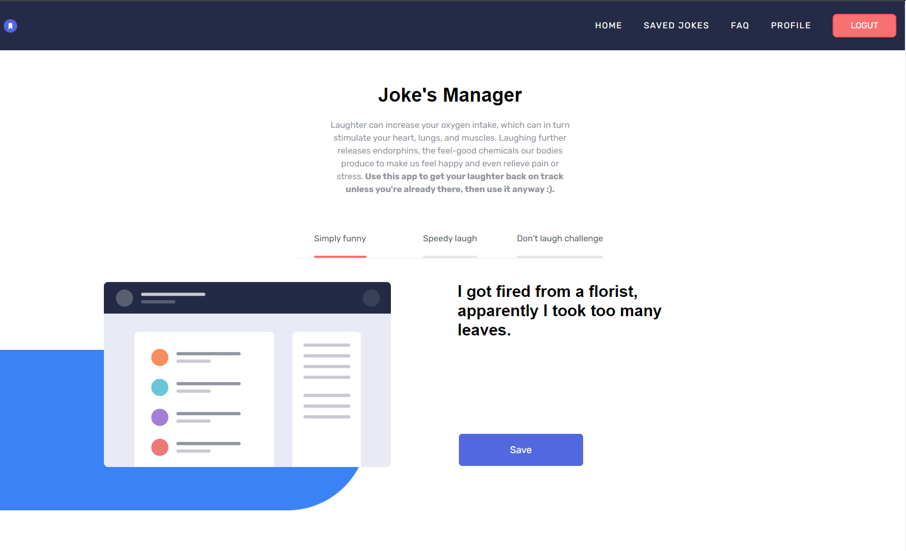
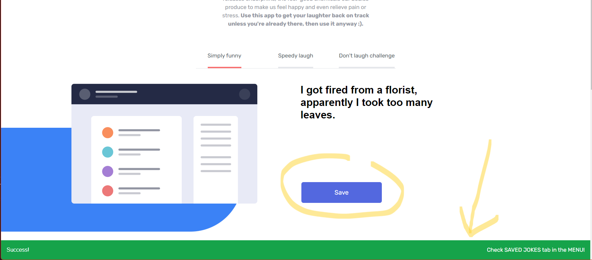
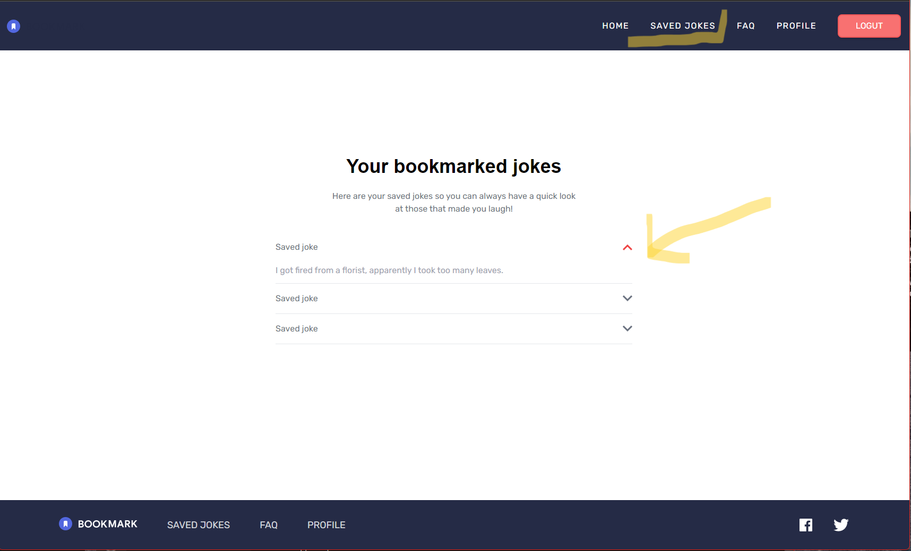
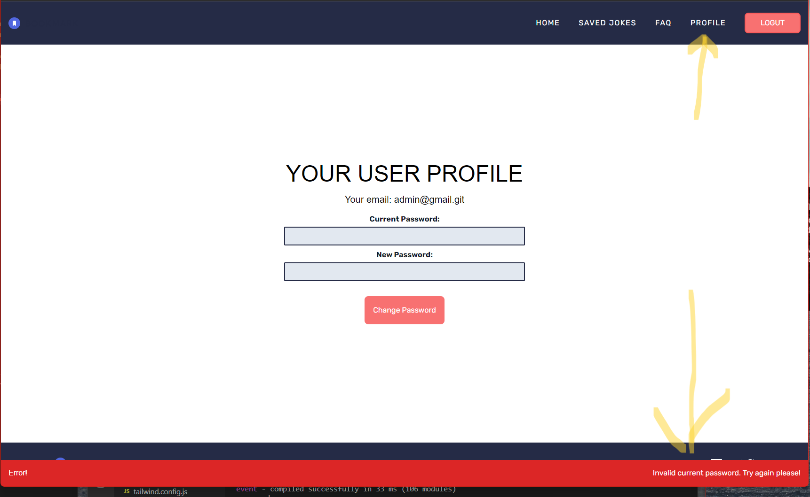
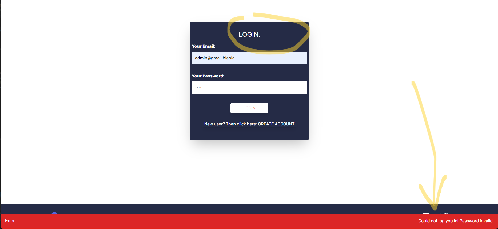
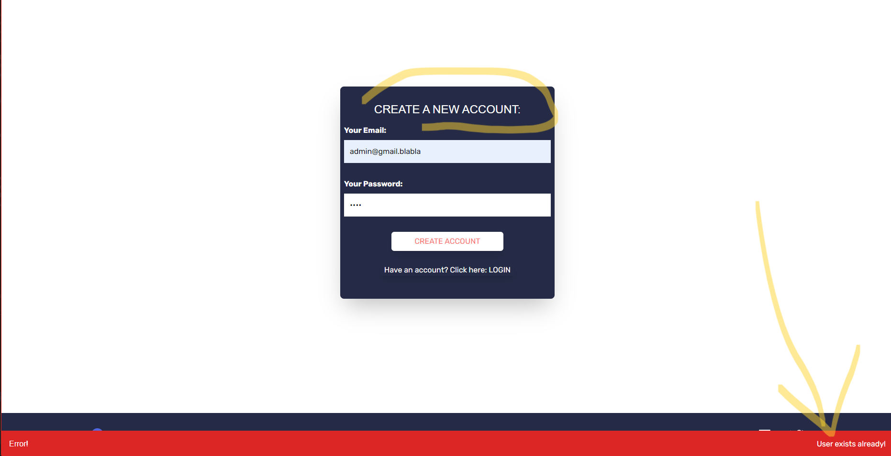

## Getting Started [![LinkedIn][linkedin-shield]][linkedin-url]

This is a [Next.js](https://nextjs.org/) project bootstrapped with [`create-next-app`](https://github.com/vercel/next.js/tree/canary/packages/create-next-app).

<!-- PROJECT LOGO -->
 

  

    'joke's manager' is a fullstack Next.js app - this repository contains its source code
        
    <a href="https://react-next-auth-ashy.vercel.app/"><strong>View the deployed app on Vercel »</strong></a>
     
     
   
  

<!-- TABLE OF CONTENTS -->

  
Table of Contents

  <ol>
    <li><a href="#about-the-project">About The Project</a></li>
    <li><a href="#built-with">Built With</a></li>
    <li><a href="#acknowledgments">Acknowledgments</a></li>
  </ol>

<!-- ABOUT THE PROJECT -->
## About The Project

* Generate a joke a save it on your account. User login/create account interface. A fullstack Next.js app. Static Site Generation (SSG), Incremental Static Regeneration (ISG) for better Search Engine Optimazation (SEO) and speed. Also Server Side Rendering (SSR) in use. NextAuth for Authentication and route protection on the client and the server side. MongoDB for data storage. React Context for app wide state management. Notification for better UX when fetching data from backend APIs or external APIs.
* Tailwind is used for styling following the Tailwind for Next.js instalation: https://tailwindcss.com/docs/guides/nextjs. Some custom classes are defined in tailwind.config.js.

1. Jokes can be chosen from three different categories: Simply Funny, Speedy laugh, Don't Laugh Challenge.
The initial joke on the first render is fetched on the server at a build time with SSG + ISG: getStaticProps function na revalidate property in index.js.
Once the site is loaded the jokes are fetched from the client side from jokes.js component.
Upon clicking on 'Save' button a joke get saved in MongoDB on the user profile.

2. In the savedJokes.js jokes get fetched from MongoDB on the server with SSG using getServerSideProps function. Because we need token from NextAuth we can not use SSG (that token has to come with the request and at build time when SSG can happen requests from the client can obvioulsy not arrive).  
* We can also see custom notifications coming from the backend API's about the status of the ongoing requests. Notifications are managed with React Context.

3. profile.js page offers change password to the user with again custom notifications from the backend.

4. User login interface in auth.js

5.  User create account interface also in auth.js

(<a href="#readme-top">back to top</a>)

### Built With

* Tailwind
* Next.js
* NextAuth.js
* Vercel for deployment
* GitHub pages for version control,
* GitHub as a remote repository,
* Visual Studio Code as a local IDE & repository,
* Chrome Developer Tools for testing screen sizes and using Lighthouse,
* Chrome, Firefox, Brave Browser, Edge and Opera for browser testing the responsiveness,
* https://wave.webaim.org/ to check web accessibility,
* https://balsamiq.com/ for wireframing.

(<a href="#readme-top">back to top</a>)

<!-- ACKNOWLEDGMENTS -->
## Acknowledgments

* Udemy courses on Tailwind: https://www.udemy.com/course/tailwind-from-scratch/
and Next.js: https://www.udemy.com/course/nextjs-react-the-complete-guide/

(<a href="#readme-top">back to top</a>)

<!-- MARKDOWN LINKS & IMAGES -->

[linkedin-shield]: https://img.shields.io/badge/-LinkedIn-black.svg?style=for-the-badge&logo=linkedin&colorB=555
[linkedin-url]: https://www.linkedin.com/in/tomasz-s-069249244/
[product-screenshot]: images/screenshot.png
[Next.js]: https://img.shields.io/badge/next.js-000000?style=for-the-badge&logo=nextdotjs&logoColor=white
[Next-url]: https://nextjs.org/
[React.js]: https://img.shields.io/badge/React-20232A?style=for-the-badge&logo=react&logoColor=61DAFB
[React-url]: https://reactjs.org/
[Vue.js]: https://img.shields.io/badge/Vue.js-35495E?style=for-the-badge&logo=vuedotjs&logoColor=4FC08D
[Vue-url]: https://vuejs.org/
[Angular.io]: https://img.shields.io/badge/Angular-DD0031?style=for-the-badge&logo=angular&logoColor=white
[Angular-url]: https://angular.io/
[Svelte.dev]: https://img.shields.io/badge/Svelte-4A4A55?style=for-the-badge&logo=svelte&logoColor=FF3E00
[Svelte-url]: https://svelte.dev/
[Laravel.com]: https://img.shields.io/badge/Laravel-FF2D20?style=for-the-badge&logo=laravel&logoColor=white
[Laravel-url]: https://laravel.com
[Bootstrap.com]: https://img.shields.io/badge/Bootstrap-563D7C?style=for-the-badge&logo=bootstrap&logoColor=white
[Bootstrap-url]: https://getbootstrap.com
[JQuery.com]: https://img.shields.io/badge/jQuery-0769AD?style=for-the-badge&logo=jquery&logoColor=white
[JQuery-url]: https://jquery.com 

